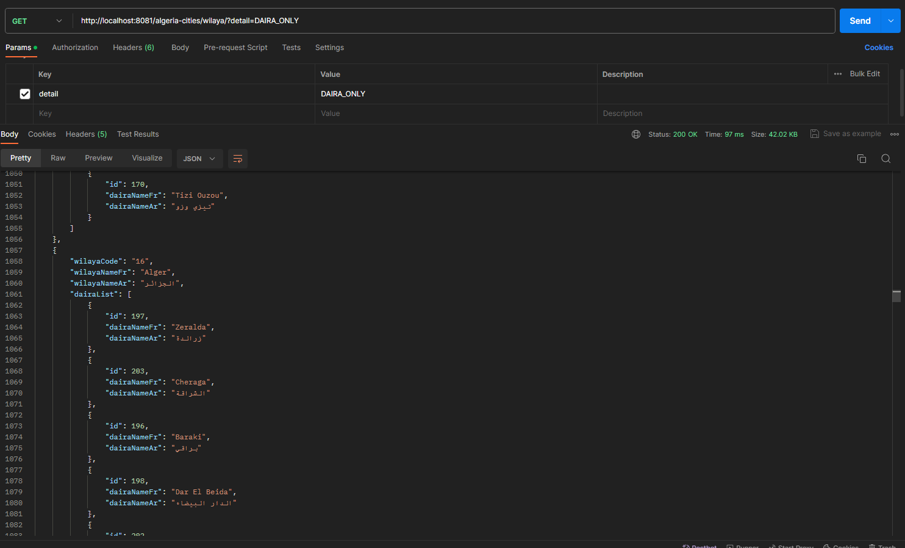

## Algerian Wilaya Details (Daira - Commune - Postal Code & Adress)

### Description

This repository is a Rest API that list all administrative provinces and cities in Algeria.
JSON format is returned including the two language Arabic and French.

### Framework & libraries Used

The project is on Spring Boot 3 & JDK 17, below more details :

| Technology                | Version |
|---------------------------|---------|
| Spring Boot               | 3.1.5   |
| JDK                       | 17      |
| Spring Starter Web        | 3.1.5   |
| Spring Starter Data       | 3.1.5   |
| Spring Starter Actuator   | 3.1.5   |
| Spring Starter Validation | 3.1.5   |
| micrometer prometheus     | 1.11.5  |
| Lombok                    | 1.18.30 |
| H2 Database               | 2.1.214 |

### Example

